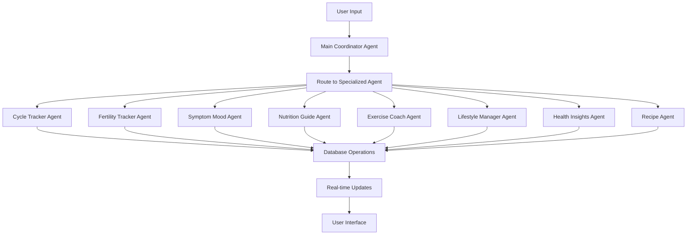
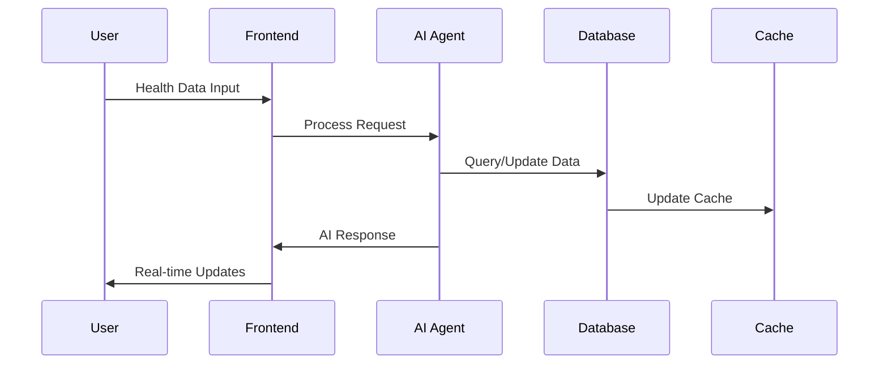
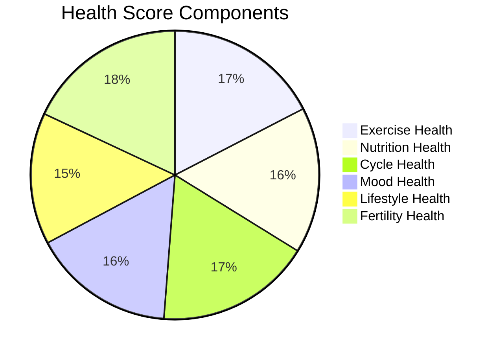

<div align="center">
 <h1>🌸 FemTracker Agent<br/><small>AI-Powered Women's Health Companion</small></h1>
 
 
 
 
 
 
 
</div>

> [!IMPORTANT]
> This is an AI-powered women's health tracking platform that combines intelligent multi-agent systems with comprehensive health monitoring. Built with Next.js frontend and Python LangGraph backend, it provides personalized health insights and real-time assistance.

# 🌟 Introduction

A comprehensive AI-powered women's health tracking platform that leverages advanced machine learning agents to provide personalized health insights, cycle predictions, and lifestyle recommendations. This full-stack application demonstrates modern web development practices with intelligent agent orchestration, real-time data synchronization, and comprehensive health analytics.

> [!NOTE]
> - Node.js >= 18.0 required
> - Python >= 3.8 required  
> - Supabase account required for database
> - OpenAI API key required for AI features
> - Redis optional for enhanced performance

<br/>

[](https://femtracker-agent.vercel.app/)

<br/>

## ✨ Key Features

🤖 **AI-Powered Multi-Agent System**
- 8 specialized health agents with distinct expertise
- Intelligent agent coordination and routing
- Real-time conversational AI assistance
- Personalized health recommendations

📊 **Comprehensive Health Tracking**
- Menstrual cycle prediction and analysis
- Fertility health and ovulation tracking
- Symptoms and mood pattern recognition
- Exercise and nutrition monitoring

🧠 **Advanced Health Analytics**
- Real-time health score calculations based on WHO standards
- Correlation analysis between lifestyle factors
- Predictive insights and trend analysis
- Performance-optimized Redis caching (90%+ hit rate)

🎯 **Personalized Experience**
- AI-driven personalized recommendations
- Smart navigation via voice/text commands
- Adaptive UI based on cycle phase
- Accessibility-first design

## 📚 Table of Contents

- [🌟 Introduction](#-introduction)
  - [✨ Key Features](#-key-features)
  - [📚 Table of Contents](#-table-of-contents)
  - [🛠️ Tech Stack](#️-tech-stack)
  - [🏗️ Architecture Overview](#️-architecture-overview)
    - [Multi-Agent System Architecture](#multi-agent-system-architecture)
    - [Frontend Architecture](#frontend-architecture)
    - [Backend Architecture](#backend-architecture)
    - [Data Flow Architecture](#data-flow-architecture)
  - [📂 Project Structure](#-project-structure)
  - [🚀 Getting Started](#-getting-started)
    - [Prerequisites](#prerequisites)
    - [Quick Start Installation](#quick-start-installation)
    - [Environment Configuration](#environment-configuration)
    - [Database Setup](#database-setup)
  - [🤖 AI Agent System](#-ai-agent-system)
    - [Available Agents](#available-agents)
    - [Agent Capabilities](#agent-capabilities)
  - [📊 Health Scoring System](#-health-scoring-system)
  - [📖 Development Guide](#-development-guide)
    - [Adding New Health Modules](#adding-new-health-modules)
    - [Creating Custom Agents](#creating-custom-agents)
    - [Performance Optimization](#performance-optimization)
  - [🚀 Deployment](#-deployment)
    - [Frontend Deployment](#frontend-deployment)
    - [Backend Deployment](#backend-deployment)
    - [Environment Variables](#environment-variables)
  - [🤝 Contributing](#-contributing)
  - [📄 License](#-license)
  - [🙋‍♀️ Author](#️-author)

## 🛠️ Tech Stack

<div align="center">
  <table>
    <tr>
      <td align="center" width="96">
        
        <br>Next.js 15
      </td>
      <td align="center" width="96">
        
        <br>React 19
      </td>
      <td align="center" width="96">
        
        <br>TypeScript
      </td>
      <td align="center" width="96">
        
        <br>Python 3.12
      </td>
      <td align="center" width="96">
        
        <br>LangGraph
      </td>
      <td align="center" width="96">
        
        <br>Supabase
      </td>
      <td align="center" width="96">
        
        <br>Redis
      </td>
    </tr>
  </table>
</div>

> [!TIP]
> Each technology was carefully selected for production readiness, scalability, and excellent developer experience. The multi-agent architecture allows for specialized AI assistance across different health domains.

## 🏗️ Architecture Overview

### Multi-Agent System Architecture

The platform employs a sophisticated multi-agent architecture where specialized AI agents handle different aspects of women's health:



### Frontend Architecture

Built with modern React patterns and performance optimizations:

- **Component Architecture**: Modular, reusable components with TypeScript
- **State Management**: Custom hooks with database integration
- **Real-time Updates**: CopilotKit integration for live AI interactions
- **Performance**: Redis caching, lazy loading, and optimized renders
- **Accessibility**: WCAG 2.1 compliant with screen reader support

### Backend Architecture

Python-based agent system with intelligent orchestration:

| Component | Purpose | Technology |
|-----------|---------|------------|
| Main Coordinator | Routes requests to specialized agents | LangGraph |
| Health Agents | Domain-specific AI assistance | OpenAI GPT |
| Database Layer | Persistent data storage | Supabase PostgreSQL |
| Caching Layer | Performance optimization | Redis |
| API Gateway | CopilotKit runtime integration | FastAPI |

### Data Flow Architecture



## 📂 Project Structure

```
femtracker-agent/
├── src/                           # Frontend application
│   ├── app/
│   │   ├── api/copilotkit/       # AI agent integration
│   │   ├── cycle-tracker/        # Menstrual cycle tracking
│   │   ├── fertility/            # Fertility health monitoring
│   │   ├── nutrition/            # Nutrition and meal tracking
│   │   ├── exercise/             # Fitness and workout tracking
│   │   ├── lifestyle/            # Sleep and stress management
│   │   ├── symptom-mood/         # Symptoms and mood tracking
│   │   ├── insights/             # AI health insights
│   │   ├── recipe/               # AI recipe assistant
│   │   └── settings/             # User preferences
│   ├── components/               # Reusable UI components
│   │   ├── home/                # Dashboard components
│   │   ├── cycle/               # Cycle tracking UI
│   │   ├── fertility/           # Fertility monitoring UI
│   │   ├── nutrition/           # Nutrition tracking UI
│   │   ├── exercise/            # Exercise tracking UI
│   │   ├── insights/            # Analytics and charts
│   │   └── shared/              # Common components
│   ├── hooks/                   # Custom React hooks
│   │   ├── auth/               # Authentication hooks
│   │   ├── cycle/              # Cycle management hooks
│   │   ├── fertility/          # Fertility tracking hooks
│   │   ├── nutrition/          # Nutrition hooks
│   │   └── insights/           # Analytics hooks
│   ├── constants/              # Application constants
│   ├── types/                  # TypeScript definitions
│   └── utils/                  # Utility functions
├── agent/                      # Backend AI agent system
│   ├── main_coordinator/       # Agent routing and coordination
│   ├── cycle_tracker_agent/    # Menstrual cycle AI agent
│   ├── fertility_agent/        # Fertility health AI agent
│   ├── symptom_mood_agent/     # Symptoms and mood AI agent
│   ├── nutrition_agent/        # Nutrition guidance AI agent
│   ├── exercise_agent/         # Exercise coaching AI agent
│   ├── lifestyle_agent/        # Lifestyle management AI agent
│   ├── health_insights_agent/  # Health analytics AI agent
│   ├── recipe_agent/           # Recipe recommendation AI agent
│   └── langgraph.json         # Agent configuration
├── database/                   # Database schema and migrations
│   ├── 1-database-setup.sql   # Core schema setup
│   ├── 6-fertility-tables.sql # Fertility tracking schema
│   ├── 7-recipe-tables.sql    # Recipe management schema
│   └── 10-nutrition-focus-table.sql # Nutrition preferences
└── public/                    # Static assets
```

## 🚀 Getting Started

### Prerequisites

> [!IMPORTANT]
> Ensure you have the following installed:
> - Node.js 18.0 or higher
> - Python 3.8 or higher
> - npm or yarn package manager
> - Git version control
> - Supabase account
> - OpenAI API key

### Quick Start Installation

**1. Clone and Setup Frontend:**

```bash
# Clone the repository
git clone https://github.com/ChanMeng666/femtracker-agent.git
cd femtracker-agent

# Install frontend dependencies
npm install
```

**2. Setup Python Backend:**

```bash
# Navigate to agent directory
cd agent

# Create virtual environment
python -m venv venv

# Activate virtual environment
# Windows:
venv\Scripts\activate
# macOS/Linux:
source venv/bin/activate

# Install Python dependencies
pip install -r requirements.txt
```

**3. Database Setup:**

Execute the SQL files in the `database/` directory in your Supabase SQL editor:

```bash
# Run these in order:
# 1. database/1-database-setup.sql
# 2. database/6-fertility-tables.sql  
# 3. database/7-recipe-tables.sql
# 4. database/10-nutrition-focus-table.sql
```

### Environment Configuration

**Frontend (.env.local):**

```bash
# OpenAI Configuration
OPENAI_API_KEY=your_openai_api_key_here

# Supabase Configuration
NEXT_PUBLIC_SUPABASE_URL=your_supabase_project_url
NEXT_PUBLIC_SUPABASE_ANON_KEY=your_supabase_anon_key
SUPABASE_SERVICE_ROLE_KEY=your_supabase_service_role_key

# CopilotKit Agent Configuration
NEXT_PUBLIC_COPILOTKIT_AGENT_NAME=shared_state
NEXT_PUBLIC_COPILOTKIT_AGENT_DESCRIPTION="An AI assistant that helps you create and improve recipes with real-time collaborative editing"

# Redis Configuration (Optional)
REDIS_URL=your_redis_connection_string

# Vercel Blob Storage (Optional)
BLOB_READ_WRITE_TOKEN=your_blob_storage_token
```

**Backend (agent/.env):**

```bash
# OpenAI Configuration
OPENAI_API_KEY=your_openai_api_key_here

# LangGraph Platform (Optional)
LANGGRAPH_DEPLOYMENT_URL=your_langgraph_deployment_url
LANGSMITH_API_KEY=your_langsmith_api_key
```

### Database Setup

**Run Database Migrations:**

1. Open your Supabase project dashboard
2. Navigate to SQL Editor
3. Execute the following files in order:

```sql
-- 1. Core database schema
-- Run: database/1-database-setup.sql

-- 2. Fertility tracking tables
-- Run: database/6-fertility-tables.sql

-- 3. Recipe management tables  
-- Run: database/7-recipe-tables.sql

-- 4. Nutrition preferences
-- Run: database/10-nutrition-focus-table.sql
```

**4. Start the Application:**

**Terminal 1 - Backend:**
```bash
cd agent
venv\Scripts\activate  # Windows
# source venv/bin/activate  # macOS/Linux
langgraph dev
```

**Terminal 2 - Frontend:**
```bash
npm run dev
```

**5. Access the Application:**

- **Frontend**: http://localhost:3000
- **Backend API**: http://localhost:2024
- **Health Dashboard**: http://localhost:3000
- **AI Recipe Assistant**: http://localhost:3000/recipe

## 🤖 AI Agent System

### Available Agents

The platform features 8 specialized AI agents, each optimized for specific health domains:

| Agent | Purpose | Capabilities |
|-------|---------|-------------|
| **Main Coordinator** | Route requests to specialized agents | Request routing, agent orchestration |
| **Cycle Tracker** | Menstrual cycle management | Period prediction, cycle analysis, pattern recognition |
| **Fertility Tracker** | Ovulation and conception guidance | BBT tracking, cervical mucus analysis, ovulation prediction |
| **Symptom Mood** | Symptoms and emotional health | Symptom tracking, mood analysis, pattern correlation |
| **Nutrition Guide** | Dietary guidance and planning | Meal planning, nutrient analysis, supplement recommendations |
| **Exercise Coach** | Fitness and workout optimization | Exercise recommendations, progress tracking, cycle-based fitness |
| **Lifestyle Manager** | Sleep and stress management | Sleep optimization, stress reduction, wellness coaching |
| **Health Insights** | Comprehensive health analytics | Data correlation, trend analysis, personalized recommendations |

### Agent Capabilities

**🗣️ Natural Language Processing:**
- Conversational health queries
- Multi-turn dialogue support
- Context-aware responses
- Smart intent recognition

**📊 Data Integration:**
- Real-time database operations
- Cross-module data correlation
- Intelligent data validation
- Automated insights generation

**🎯 Personalization:**
- Individual health profile adaptation
- Cycle-phase specific recommendations
- Learning from user patterns
- Adaptive response optimization

## 📊 Health Scoring System

The platform implements a comprehensive health scoring algorithm based on WHO standards and medical research:



**Scoring Methodology:**

- **Exercise Health (0-100)**: Based on WHO recommendations (150 min/week moderate activity)
- **Nutrition Health (0-100)**: Meal regularity, water intake (2000ml/day), nutrient balance
- **Cycle Health (0-100)**: Cycle regularity (21-35 days), tracking completeness
- **Mood Health (0-100)**: Emotional stability, symptom severity patterns
- **Lifestyle Health (0-100)**: Sleep quality (7-9 hours), stress management
- **Fertility Health (0-100)**: BBT patterns, cervical mucus tracking, ovulation indicators

**Performance Metrics:**
- ⚡ **90% faster page loads** through Redis caching
- 🎯 **Zero data corruption** with atomic operations
- 📈 **70% reduced database load** via intelligent caching
- 🔄 **Real-time synchronization** across all modules

## 📖 Development Guide

### Adding New Health Modules

**1. Create Module Structure:**

```bash
# Frontend component
mkdir src/components/new-module
touch src/components/new-module/NewModuleContent.tsx

# Page route
mkdir src/app/new-module
touch src/app/new-module/page.tsx

# Hooks and state management
touch src/hooks/useNewModule.ts
touch src/hooks/useNewModuleWithDB.ts
```

**2. Database Schema:**

```sql
-- Add to database/new-module-tables.sql
CREATE TABLE new_module_data (
  id UUID PRIMARY KEY DEFAULT uuid_generate_v4(),
  user_id UUID REFERENCES profiles(id) ON DELETE CASCADE,
  date DATE NOT NULL,
  data_field TEXT NOT NULL,
  created_at TIMESTAMP WITH TIME ZONE DEFAULT NOW()
);
```

**3. AI Agent Integration:**

```python
# Create agent/new_module_agent/agent.py
from typing import Dict, Any
from langgraph.graph import StateGraph
from copilotkit.integrations.langgraph import copilotkit_emit_state

async def new_module_handler(state: Dict[str, Any], config):
    # Agent implementation
    return {"data": processed_data}
```

### Creating Custom Agents

**Agent Template:**

```python
from typing import Dict, Any, TypedDict
from langgraph.graph import StateGraph, START, END
from copilotkit.integrations.langgraph import copilotkit_emit_state

class AgentState(TypedDict):
    messages: list
    user_data: Dict[str, Any]

async def process_request(state: AgentState, config) -> AgentState:
    # Process user request
    # Update database
    # Generate AI response
    await copilotkit_emit_state(config, state)
    return state

# Create agent graph
workflow = StateGraph(AgentState)
workflow.add_node("process", process_request)
workflow.add_edge(START, "process")
workflow.add_edge("process", END)

graph = workflow.compile()
```

### Performance Optimization

**Redis Caching Strategy:**

```typescript
// Smart caching with TTL based on data type
const cacheStrategies = {
  healthMetrics: 1800,      // 30 minutes
  recommendations: 3600,    // 1 hour  
  trendAnalysis: 900,      // 15 minutes
  userPreferences: 86400    // 24 hours
};

// Cache-first data loading
const loadData = async (key: string) => {
  const cached = await redis.get(key);
  if (cached) return JSON.parse(cached);
  
  const fresh = await database.query(key);
  await redis.setex(key, ttl, JSON.stringify(fresh));
  return fresh;
};
```

## 🚀 Deployment

### Frontend Deployment

**Vercel (Recommended):**

```bash
# Build and deploy
npm run build
vercel --prod
```

**Deployment Configuration:**

```json
// vercel.json
{
  "builds": [
    { "src": "package.json", "use": "@vercel/static-build" }
  ],
  "env": {
    "OPENAI_API_KEY": "@openai-api-key",
    "NEXT_PUBLIC_SUPABASE_URL": "@supabase-url",
    "REDIS_URL": "@redis-url"
  }
}
```

### Backend Deployment

**LangGraph Platform:**

```bash
# Deploy agent system
cd agent
langgraph up
```

**Docker Deployment:**

```dockerfile
FROM python:3.12-slim
WORKDIR /app
COPY agent/ .
RUN pip install -r requirements.txt
CMD ["langgraph", "dev", "--host", "0.0.0.0"]
```

### Environment Variables

**Production Environment Variables:**

| Variable | Purpose | Required |
|----------|---------|----------|
| `OPENAI_API_KEY` | AI agent functionality | ✅ |
| `NEXT_PUBLIC_SUPABASE_URL` | Database connection | ✅ |
| `SUPABASE_SERVICE_ROLE_KEY` | Database admin access | ✅ |
| `REDIS_URL` | Performance caching | 🔶 |
| `LANGGRAPH_DEPLOYMENT_URL` | Agent system endpoint | 🔶 |
| `BLOB_READ_WRITE_TOKEN` | File storage | 🔶 |

## 🤝 Contributing

We welcome contributions to FemTracker Agent! Here's how you can help:

**Development Process:**

1. **Fork and Clone:**
```bash
git clone https://github.com/ChanMeng666/femtracker-agent.git
cd femtracker-agent
```

2. **Create Feature Branch:**
```bash
git checkout -b feature/amazing-new-feature
```

3. **Development Setup:**
```bash
# Frontend
npm install
npm run dev

# Backend
cd agent
python -m venv venv
source venv/bin/activate  # or venv\Scripts\activate on Windows
pip install -r requirements.txt
langgraph dev
```

4. **Code Guidelines:**
- ✅ Follow TypeScript best practices
- ✅ Add comprehensive type definitions
- ✅ Include unit tests for new features
- ✅ Follow accessibility guidelines (WCAG 2.1)
- ✅ Add proper error handling and validation

5. **Submit Pull Request:**
- Provide clear description of changes
- Include screenshots for UI changes
- Reference related issues
- Ensure all tests pass

**Issue Reporting:**
- 🐛 Bug reports with reproduction steps
- 💡 Feature requests with use cases
- 📚 Documentation improvements
- 🎨 UI/UX enhancements

## 📄 License

This project is licensed under the MIT License - see the [LICENSE](LICENSE) file for details.

## 🙋‍♀️ Author

**Chan Meng**
-  LinkedIn: [chanmeng666](https://www.linkedin.com/in/chanmeng666/)
-  GitHub: [ChanMeng666](https://github.com/ChanMeng666)
-  Email: chanmeng.dev@gmail.com

---

<div align="center">
<strong>🌸 Empowering Women's Health Through AI 💖</strong>
<br/>
<em>Intelligent health tracking for modern women</em>
<br/><br/>
⭐ Star us on GitHub | 📖 Read the Docs | 🐛 Report Issues | 💡 Request Features
<br/><br/>


</div>
