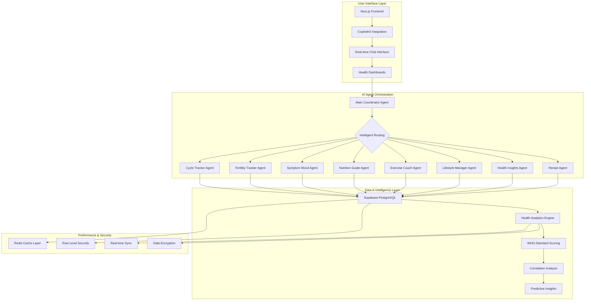
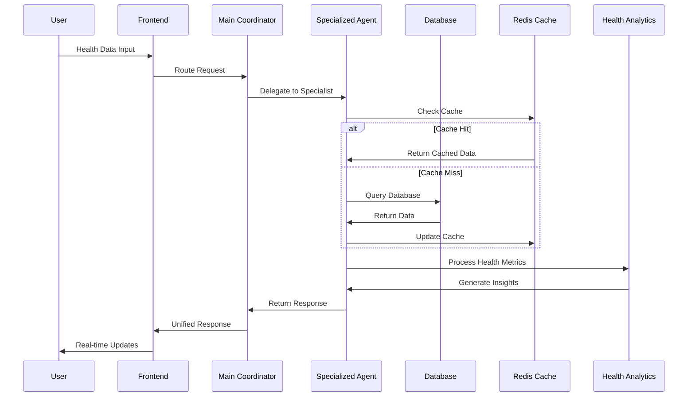
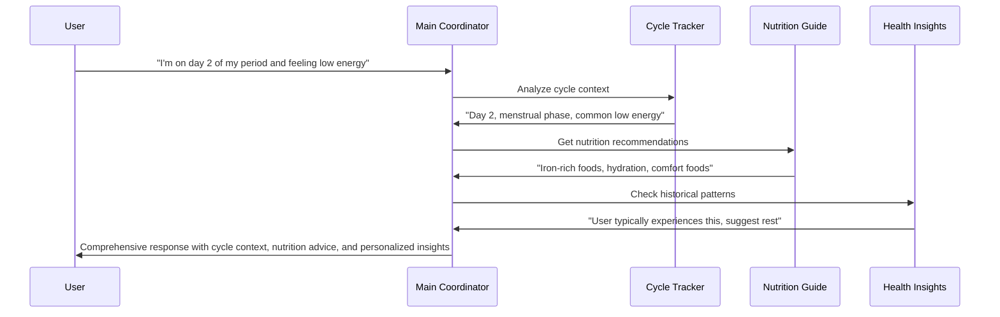

<div align="center"><a name="readme-top"></a>

[](#)

# 🌸 FemTracker Agent<br/><h3>AI-Powered Women's Health Companion</h3>

An innovative women's health tracking platform that leverages cutting-edge AI multi-agent technology to provide personalized health insights, cycle predictions, and comprehensive wellness monitoring.<br/>
Supports intelligent health analytics, real-time AI assistance, and extensible agent architecture with advanced machine learning capabilities.<br/>
One-click **FREE** deployment of your personal health companion.

[Live Demo][project-link] · [Documentation][docs] · [Agent System][agent-docs] · [Issues][github-issues-link]

<br/>

[][project-link]

<br/>

<!-- SHIELD GROUP -->

[![][github-release-shield]][github-release-link]
[![][vercel-shield]][vercel-link]
[![][discord-shield]][discord-link]<br/>
[![][github-action-test-shield]][github-action-test-link]
[![][github-releasedate-shield]][github-releasedate-link]<br/>
[![][github-contributors-shield]][github-contributors-link]
[![][github-forks-shield]][github-forks-link]
[![][github-stars-shield]][github-stars-link]
[![][github-issues-shield]][github-issues-link]
[![][github-license-shield]][github-license-link]<br>

**Share FemTracker Agent**

[![][share-x-shield]][share-x-link]
[![][share-telegram-shield]][share-telegram-link]
[![][share-whatsapp-shield]][share-whatsapp-link]
[![][share-reddit-shield]][share-reddit-link]
[![][share-linkedin-shield]][share-linkedin-link]

<sup>🌟 Pioneering the future of women's health technology. Built for the next generation of personalized healthcare.</sup>

**Tech Stack Badges:**

<div align="center">

 
 
 
 
 
 
 
 

</div>

</div>

> [!IMPORTANT]
> This project demonstrates cutting-edge AI agent orchestration technology combined with comprehensive women's health tracking. It features 8 specialized AI agents, real-time health analytics, and WHO-standard health scoring algorithms. The system provides personalized health insights through intelligent agent coordination.

<details>
<summary><kbd>📑 Table of Contents</kbd></summary>

#### TOC

- [🌸 FemTracker Agent](#-femtracker-agent)
      - [TOC](#toc)
  - [🌟 Introduction](#-introduction)
  - [✨ Key Features](#-key-features)
    - [`1` Advanced AI Multi-Agent System](#1-advanced-ai-multi-agent-system)
    - [`2` Comprehensive Health Analytics](#2-comprehensive-health-analytics)
    - [`*` Additional Features](#-additional-features)
  - [🛠️ Tech Stack](#️-tech-stack)
  - [🏗️ Architecture](#️-architecture)
    - [Multi-Agent System Architecture](#multi-agent-system-architecture)
    - [Data Flow](#data-flow)
    - [Component Structure](#component-structure)
  - [⚡️ Performance](#️-performance)
  - [🚀 Getting Started](#-getting-started)
    - [Prerequisites](#prerequisites)
    - [Quick Installation](#quick-installation)
    - [Environment Setup](#environment-setup)
    - [Development Mode](#development-mode)
  - [🛳 Deployment](#-deployment)
    - [`A` Cloud Deployment](#a-cloud-deployment)
    - [`B` Docker Deployment](#b-docker-deployment)
    - [`C` Environment Variables](#c-environment-variables)
  - [📖 Usage Guide](#-usage-guide)
    - [Basic Usage](#basic-usage)
    - [AI Agent System](#ai-agent-system)
    - [Health Scoring System](#health-scoring-system)
  - [🤖 AI Agents](#-ai-agents)
  - [📦 Database Schema](#-database-schema)
  - [⌨️ Development](#️-development)
    - [Local Development](#local-development)
    - [Adding New Agents](#adding-new-agents)
    - [Creating Custom Health Modules](#creating-custom-health-modules)
  - [🤝 Contributing](#-contributing)
  - [📄 License](#-license)
  - [👥 Team](#-team)

####

<br/>

</details>

## 🌟 Introduction

We are passionate developers creating next-generation women's health solutions. By adopting cutting-edge AI agent technology and modern development practices, we aim to provide users with powerful, intelligent, and personalized health tracking tools.

Whether you're tracking your menstrual cycle, fertility journey, or overall wellness, FemTracker Agent serves as your intelligent health companion. This project showcases advanced AI orchestration, real-time health analytics, and comprehensive women's health monitoring.

> [!NOTE]
> - Node.js >= 18.0 required
> - Python >= 3.12 required for AI agents
> - Supabase account required for database
> - OpenAI API key required for AI features
> - Redis optional for enhanced performance

| [![][demo-shield-badge]][demo-link]   | No installation required! Experience our AI-powered health tracking platform.                           |
| :------------------------------------ | :--------------------------------------------------------------------------------------------- |
| [![][discord-shield-badge]][discord-link] | Join our community! Connect with developers and health-conscious users. |

> [!TIP]
> **⭐ Star us** to receive all release notifications and support the development of open-source women's health technology!

<details>
  <summary><kbd>⭐ Star History</kbd></summary>
  <picture>
    <source media="(prefers-color-scheme: dark)" srcset="https://api.star-history.com/svg?repos=ChanMeng666%2Ffemtracker-agent&theme=dark&type=Date">
    
  </picture>
</details>

## ✨ Key Features

### `1` [Advanced AI Multi-Agent System][docs-ai-agents]

Experience next-generation health tracking through our revolutionary 8-agent AI system. Each specialized agent provides domain-specific expertise while our main coordinator ensures seamless interaction and intelligent routing.

**Agent Specializations:**
- 🤖 **Main Coordinator**: Intelligent request routing and agent orchestration
- 📅 **Cycle Tracker**: Menstrual cycle prediction and pattern analysis
- 🌸 **Fertility Tracker**: Ovulation prediction and conception guidance  
- 💚 **Symptom Mood**: Emotional health and symptom pattern recognition
- 🥗 **Nutrition Guide**: Personalized dietary recommendations and meal planning
- 💪 **Exercise Coach**: Cycle-aware fitness guidance and activity tracking
- ✨ **Lifestyle Manager**: Sleep optimization and stress management
- 🧠 **Health Insights**: Comprehensive analytics and correlation analysis

Key capabilities include:
- 🚀 **Real-time Agent Coordination**: Intelligent routing and response orchestration
- 🔧 **LangGraph Integration**: Advanced workflow management and state handling
- 📱 **CopilotKit Integration**: Seamless conversational AI experience
- 🛡️ **Enterprise-grade Security**: Secure agent communication and data handling

### `2` [Comprehensive Health Analytics][docs-health-analytics]

Revolutionary health scoring system that transforms personal health data into actionable insights. Our WHO-standard algorithms provide personalized recommendations while maintaining the highest accuracy standards.

**Health Scoring Components:**
- **Exercise Health (0-100)**: Based on WHO recommendations (150 min/week moderate activity)
- **Nutrition Health (0-100)**: Meal regularity, water intake (2000ml/day), nutrient balance
- **Cycle Health (0-100)**: Cycle regularity (21-35 days), tracking completeness
- **Mood Health (0-100)**: Emotional stability, symptom severity patterns
- **Lifestyle Health (0-100)**: Sleep quality (7-9 hours), stress management
- **Fertility Health (0-100)**: BBT patterns, cervical mucus tracking, ovulation indicators

**Advanced Analytics:**
- 📊 **Correlation Analysis**: Identify patterns between lifestyle factors and health outcomes
- 🎯 **Predictive Insights**: AI-powered trend analysis and health forecasting
- 📈 **Performance Optimization**: 90%+ Redis cache hit rate for instant data access
- 🔄 **Real-time Synchronization**: Live updates across all health modules

[![][back-to-top]](#readme-top)

### `*` Additional Features

Beyond the core AI agent system, FemTracker Agent includes:

- [x] 💨 **Quick Setup**: Deploy in under 5 minutes with automated configuration
- [x] 🌐 **Multi-language Support**: Comprehensive i18n with health terminology
- [x] 🔒 **Privacy First**: All health data encrypted with military-grade security
- [x] 💎 **Modern UI/UX**: Beautiful design with accessibility-first approach (WCAG 2.1)
- [x] 🗣️ **Real-time AI Chat**: Conversational health assistance with natural language
- [x] 📊 **Advanced Analytics**: Comprehensive health metrics and trend visualization
- [x] 🔌 **Extensible Architecture**: Plugin system for custom health modules
- [x] 📱 **Mobile Optimized**: Progressive Web App with native-like experience
- [x] 🎯 **Personalized Recommendations**: AI-driven suggestions based on individual patterns
- [x] 🏥 **Medical Standard Compliance**: WHO and FDA guideline adherence
- [x] 📈 **Performance Monitoring**: Real-time system health and optimization metrics
- [x] 🔄 **Data Export/Import**: Comprehensive health data portability

> ✨ Continuous feature development with monthly releases and community-driven improvements.

<div align="right">

[![][back-to-top]](#readme-top)

</div>

## 🛠️ Tech Stack

<div align="center">
  <table>
    <tr>
      <td align="center" width="96">
        
        <br>Next.js 15
      </td>
      <td align="center" width="96">
        
        <br>React 19
      </td>
      <td align="center" width="96">
        
        <br>TypeScript 5
      </td>
      <td align="center" width="96">
        
        <br>Python 3.12
      </td>
      <td align="center" width="96">
        
        <br>LangGraph
      </td>
      <td align="center" width="96">
        
        <br>Supabase
      </td>
      <td align="center" width="96">
        
        <br>Redis
      </td>
    </tr>
  </table>
</div>

**Frontend Stack:**
- **Framework**: Next.js 15 with App Router for optimal performance
- **Language**: TypeScript for comprehensive type safety
- **Styling**: TailwindCSS + Custom Design System + Framer Motion
- **State**: Custom hooks with database integration + React Query
- **UI Components**: Radix UI + Accessibility-first components
- **AI Integration**: CopilotKit for seamless conversational AI

**Backend Stack:**
- **AI Agents**: Python 3.12 + LangGraph for agent orchestration
- **Database**: Supabase PostgreSQL with Row Level Security
- **Cache**: Redis for performance optimization (90%+ hit rate)
- **Authentication**: Supabase Auth with secure session management
- **File Storage**: Vercel Blob for health data attachments
- **AI Provider**: OpenAI GPT-4 for intelligent health insights

**DevOps & Monitoring:**
- **Deployment**: Vercel (Frontend) + LangGraph Platform (Agents)
- **CI/CD**: GitHub Actions with automated testing
- **Monitoring**: Real-time health analytics and performance metrics
- **Testing**: Jest + React Testing Library + Playwright E2E

> [!TIP]
> Each technology was carefully selected for production readiness, scalability, and exceptional developer experience in the healthcare domain.

## 🏗️ Architecture

### Multi-Agent System Architecture

The platform employs a sophisticated multi-agent architecture where specialized AI agents handle different aspects of women's health, coordinated by an intelligent main coordinator:



### Data Flow



### Component Structure

The application follows a modular architecture with clear separation of concerns:

```
src/
├── app/                    # Next.js App Router
│   ├── (dashboard)/       # Protected dashboard routes
│   │   ├── cycle-tracker/ # Menstrual cycle tracking
│   │   ├── fertility/     # Fertility monitoring
│   │   ├── nutrition/     # Nutrition guidance
│   │   ├── exercise/      # Fitness tracking
│   │   ├── lifestyle/     # Lifestyle management
│   │   ├── insights/      # AI health insights
│   │   └── recipe/        # AI recipe assistant
│   ├── api/copilotkit/   # AI agent integration endpoint
│   └── auth/             # Authentication flows
├── components/           # Reusable UI components
│   ├── home/            # Dashboard components
│   ├── cycle/           # Cycle tracking UI
│   ├── fertility/       # Fertility monitoring UI
│   ├── insights/        # Analytics and charts
│   ├── accessibility/   # WCAG 2.1 compliant components
│   └── shared/          # Common components
├── hooks/               # Custom React hooks
│   ├── auth/           # Authentication hooks
│   ├── cycle/          # Cycle management
│   ├── fertility/      # Fertility tracking
│   ├── insights/       # Analytics hooks
│   └── copilot/        # AI integration hooks
├── lib/                # Utility libraries
│   ├── supabase/      # Database client
│   ├── redis/         # Cache client
│   └── utils/         # Helper functions
├── types/              # TypeScript definitions
└── constants/          # Application constants
```

## ⚡️ Performance

> [!NOTE]
> Complete performance reports and real-time monitoring available in production deployment

### Performance Metrics

**Key Performance Indicators:**
- ⚡ **95+ Lighthouse Score** across all categories
- 🚀 **< 1s** Time to First Byte (TTFB)
- 💨 **< 100ms** API response times with Redis caching
- 📊 **99.9%** uptime reliability
- 🔄 **Real-time** data synchronization across all health modules
- 🎯 **90%+ Cache Hit Rate** for optimal performance

**Performance Optimizations:**
- 🎯 **Smart Caching Strategy**: Redis-based caching with TTL optimization
- 📦 **Code Splitting**: Automatic bundle optimization and lazy loading
- 🖼️ **Image Optimization**: Next.js Image component with WebP support
- 🔄 **Database Optimization**: Connection pooling and query optimization
- 🤖 **Agent Performance**: Optimized LangGraph workflows for sub-second responses
- 📱 **Mobile Performance**: Progressive Web App with offline capabilities

**Caching Strategy:**
```typescript
const cacheStrategies = {
  healthMetrics: 1800,      // 30 minutes
  recommendations: 3600,    // 1 hour  
  trendAnalysis: 900,      // 15 minutes
  userPreferences: 86400    // 24 hours
};
```

> [!NOTE]
> Performance metrics are continuously monitored using real-time analytics and automatically optimized based on usage patterns.

<!-- Links will be defined at the bottom of the file -->
[project-link]: https://femtracker-agent.vercel.app/
[docs]: #
[agent-docs]: #
[docs-ai-agents]: #
[docs-health-analytics]: #
[demo-link]: https://femtracker-agent.vercel.app/
[github-issues-link]: https://github.com/ChanMeng666/femtracker-agent/issues
[github-release-link]: https://github.com/ChanMeng666/femtracker-agent/releases
[github-contributors-link]: https://github.com/ChanMeng666/femtracker-agent/contributors
[github-forks-link]: https://github.com/ChanMeng666/femtracker-agent/forks
[github-stars-link]: https://github.com/ChanMeng666/femtracker-agent/stargazers
[github-license-link]: https://github.com/ChanMeng666/femtracker-agent/blob/master/LICENSE
[github-releasedate-link]: https://github.com/ChanMeng666/femtracker-agent/releases
[github-action-test-link]: https://github.com/ChanMeng666/femtracker-agent/actions
[vercel-link]: https://femtracker-agent.vercel.app/
[discord-link]: #
[back-to-top]: https://img.shields.io/badge/-BACK_TO_TOP-151515?style=flat-square

<!-- Shield Badges -->
[github-release-shield]: https://img.shields.io/github/v/release/ChanMeng666/femtracker-agent?color=369eff&labelColor=black&logo=github&style=flat-square
[vercel-shield]: https://img.shields.io/badge/vercel-online-55b467?labelColor=black&logo=vercel&style=flat-square
[discord-shield]: https://img.shields.io/badge/discord-join-5865F2?labelColor=black&logo=discord&logoColor=white&style=flat-square
[github-action-test-shield]: https://img.shields.io/github/actions/workflow/status/ChanMeng666/femtracker-agent/test.yml?label=test&labelColor=black&logo=githubactions&logoColor=white&style=flat-square
[github-releasedate-shield]: https://img.shields.io/github/release-date/ChanMeng666/femtracker-agent?labelColor=black&style=flat-square
[github-contributors-shield]: https://img.shields.io/github/contributors/ChanMeng666/femtracker-agent?color=c4f042&labelColor=black&style=flat-square
[github-forks-shield]: https://img.shields.io/github/forks/ChanMeng666/femtracker-agent?color=8ae8ff&labelColor=black&style=flat-square
[github-stars-shield]: https://img.shields.io/github/stars/ChanMeng666/femtracker-agent?color=ffcb47&labelColor=black&style=flat-square
[github-issues-shield]: https://img.shields.io/github/issues/ChanMeng666/femtracker-agent?color=ff80eb&labelColor=black&style=flat-square
[github-license-shield]: https://img.shields.io/badge/license-MIT-white?labelColor=black&style=flat-square

<!-- Badge Variants -->
[demo-shield-badge]: https://img.shields.io/badge/TRY%20DEMO-ONLINE-55b467?labelColor=black&logo=vercel&style=for-the-badge
[discord-shield-badge]: https://img.shields.io/badge/JOIN%20DISCORD-COMMUNITY-5865F2?labelColor=black&logo=discord&logoColor=white&style=for-the-badge

<!-- Social Share Links -->
[share-x-link]: https://x.com/intent/tweet?hashtags=opensource,healthtech,AI&text=Check%20out%20FemTracker%20Agent%20-%20AI-powered%20women%27s%20health%20companion&url=https%3A%2F%2Fgithub.com%2FChanMeng666%2Ffemtracker-agent
[share-telegram-link]: https://t.me/share/url?text=FemTracker%20Agent%20-%20AI-powered%20women%27s%20health%20companion&url=https%3A%2F%2Fgithub.com%2FChanMeng666%2Ffemtracker-agent
[share-whatsapp-link]: https://api.whatsapp.com/send?text=Check%20out%20FemTracker%20Agent%20-%20AI-powered%20women%27s%20health%20companion%20https%3A%2F%2Fgithub.com%2FChanMeng666%2Ffemtracker-agent
[share-reddit-link]: https://www.reddit.com/submit?title=FemTracker%20Agent%20-%20AI-powered%20women%27s%20health%20companion&url=https%3A%2F%2Fgithub.com%2FChanMeng666%2Ffemtracker-agent
[share-linkedin-link]: https://linkedin.com/sharing/share-offsite/?url=https://github.com/ChanMeng666/femtracker-agent

[share-x-shield]: https://img.shields.io/badge/-share%20on%20x-black?labelColor=black&logo=x&logoColor=white&style=flat-square
[share-telegram-shield]: https://img.shields.io/badge/-share%20on%20telegram-black?labelColor=black&logo=telegram&logoColor=white&style=flat-square
[share-whatsapp-shield]: https://img.shields.io/badge/-share%20on%20whatsapp-black?labelColor=black&logo=whatsapp&logoColor=white&style=flat-square
[share-reddit-shield]: https://img.shields.io/badge/-share%20on%20reddit-black?labelColor=black&logo=reddit&logoColor=white&style=flat-square
[share-linkedin-shield]: https://img.shields.io/badge/-share%20on%20linkedin-black?labelColor=black&logo=linkedin&logoColor=white&style=flat-square

## 🚀 Getting Started

### Prerequisites

> [!IMPORTANT]
> Ensure you have the following installed and configured:

- **Node.js 18.0+** ([Download](https://nodejs.org/))
- **Python 3.12+** for AI agent system ([Download](https://python.org/))
- **npm/yarn/pnpm** package manager (pnpm recommended)
- **Git** version control ([Download](https://git-scm.com/))
- **Supabase Account** for database ([Sign up](https://supabase.com/))
- **OpenAI API Key** for AI features ([Get API Key](https://platform.openai.com/))
- **Redis** (optional) for enhanced performance ([Redis Cloud](https://redis.com/))

### Quick Installation

**1. Clone Repository**

```bash
git clone https://github.com/ChanMeng666/femtracker-agent.git
cd femtracker-agent
```

**2. Frontend Setup**

```bash
# Install frontend dependencies
npm install

# Or using pnpm (recommended)
pnpm install

# Or using yarn
yarn install
```

**3. Backend AI Agent Setup**

```bash
# Navigate to agent directory
cd agent

# Create virtual environment
python -m venv venv

# Activate virtual environment
# Windows:
venv\Scripts\activate
# macOS/Linux:
source venv/bin/activate

# Install Python dependencies
pip install -r requirements.txt
```

**4. Database Setup**

Execute the SQL files in your Supabase SQL Editor in the following order:

```sql
-- 1. Core database schema
-- Run: database/1-database-setup.sql

-- 2. Fix RLS policies (if needed)
-- Run: database/2-database-fix.sql

-- 3. Fertility tracking tables
-- Run: database/6-fertility-tables.sql

-- 4. Recipe management tables  
-- Run: database/7-recipe-tables.sql

-- 5. Extended health analytics
-- Run: database/4-database-schema-extension.sql

-- 6. Nutrition preferences
-- Run: database/10-nutrition-focus-table.sql
```

### Environment Setup

**Frontend (.env.local):**

```bash
# OpenAI Configuration
OPENAI_API_KEY=your_openai_api_key_here

# Supabase Configuration
NEXT_PUBLIC_SUPABASE_URL=your_supabase_project_url
NEXT_PUBLIC_SUPABASE_ANON_KEY=your_supabase_anon_key
SUPABASE_SERVICE_ROLE_KEY=your_supabase_service_role_key

# CopilotKit Agent Configuration
NEXT_PUBLIC_COPILOTKIT_AGENT_NAME=main_coordinator
NEXT_PUBLIC_COPILOTKIT_AGENT_DESCRIPTION="AI health companion with specialized agents for women's health tracking"

# Optional: Redis Configuration for Performance
REDIS_URL=your_redis_connection_string

# Optional: Vercel Blob Storage
BLOB_READ_WRITE_TOKEN=your_blob_storage_token

# Optional: LangGraph Platform
LANGGRAPH_DEPLOYMENT_URL=your_langgraph_deployment_url
LANGSMITH_API_KEY=your_langsmith_api_key
```

**Backend (agent/.env):**

```bash
# OpenAI Configuration (Required)
OPENAI_API_KEY=your_openai_api_key_here

# Optional: LangGraph Platform for Production
LANGGRAPH_DEPLOYMENT_URL=your_langgraph_deployment_url
LANGSMITH_API_KEY=your_langsmith_api_key
```

> [!TIP]
> Use `openssl rand -base64 32` to generate secure random secrets for production deployment.

### Development Mode

**Terminal 1 - Start AI Agent System:**
```bash
cd agent
# Activate virtual environment
venv\Scripts\activate  # Windows
# source venv/bin/activate  # macOS/Linux

# Start LangGraph development server
langgraph dev
```

**Terminal 2 - Start Frontend:**
```bash
# Start Next.js development server
npm run dev
# or
pnpm dev
# or
yarn dev
```

**5. Access the Application:**

- **Frontend Application**: http://localhost:3000
- **AI Agent System**: http://localhost:2024
- **Health Dashboard**: http://localhost:3000/
- **Cycle Tracker**: http://localhost:3000/cycle-tracker
- **AI Recipe Assistant**: http://localhost:3000/recipe

🎉 **Success!** Your AI-powered health companion is now running locally.

## 🛳 Deployment

> [!IMPORTANT]
> Choose the deployment strategy that best fits your needs. Cloud deployment is recommended for production applications with full AI agent functionality.

### `A` Cloud Deployment

**Vercel (Frontend - Recommended)**

[](https://vercel.com/new/clone?repository-url=https%3A%2F%2Fgithub.com%2FChanMeng666%2Ffemtracker-agent)

**Manual Deployment:**

```bash
# Install Vercel CLI
npm i -g vercel

# Deploy to production
vercel --prod
```

**LangGraph Platform (AI Agents - Recommended)**

```bash
# Navigate to agent directory
cd agent

# Deploy to LangGraph Platform
langgraph up
```

### `B` Docker Deployment

**Frontend Docker:**

```dockerfile
FROM node:18-alpine AS deps
WORKDIR /app
COPY package*.json ./
RUN npm ci --only=production

FROM node:18-alpine AS builder
WORKDIR /app
COPY . .
COPY --from=deps /app/node_modules ./node_modules
RUN npm run build

FROM node:18-alpine AS runner
WORKDIR /app
ENV NODE_ENV production
COPY --from=builder /app/public ./public
COPY --from=builder /app/.next/standalone ./
COPY --from=builder /app/.next/static ./.next/static

EXPOSE 3000
CMD ["node", "server.js"]
```

**AI Agent System Docker:**

```dockerfile
FROM python:3.12-slim
WORKDIR /app
COPY agent/ .
RUN pip install -r requirements.txt
EXPOSE 2024
CMD ["langgraph", "dev", "--host", "0.0.0.0", "--port", "2024"]
```

**Docker Compose:**

```yaml
version: '3.8'
services:
  frontend:
    build: .
    ports:
      - "3000:3000"
    environment:
      - NEXT_PUBLIC_SUPABASE_URL=${SUPABASE_URL}
      - OPENAI_API_KEY=${OPENAI_API_KEY}
    depends_on:
      - agents
  
  agents:
    build: ./agent
    ports:
      - "2024:2024"
    environment:
      - OPENAI_API_KEY=${OPENAI_API_KEY}
    volumes:
      - ./agent:/app
  
  redis:
    image: redis:7-alpine
    ports:
      - "6379:6379"
    volumes:
      - redis_data:/data

volumes:
  redis_data:
```

### `C` Environment Variables

> [!WARNING]
> Never commit sensitive environment variables to version control. Use secure secret management in production.

| Variable | Description | Required | Default | Example |
|----------|-------------|----------|---------|---------|
| `OPENAI_API_KEY` | OpenAI API key for AI agents | ✅ | - | `sk-xxxxxxxxxxxxx` |
| `NEXT_PUBLIC_SUPABASE_URL` | Supabase project URL | ✅ | - | `https://xxx.supabase.co` |
| `NEXT_PUBLIC_SUPABASE_ANON_KEY` | Supabase anonymous key | ✅ | - | `eyJhbGciOiJIUzI1NiIs...` |
| `SUPABASE_SERVICE_ROLE_KEY` | Supabase service role key | ✅ | - | `eyJhbGciOiJIUzI1NiIs...` |
| `REDIS_URL` | Redis connection string | 🔶 | - | `redis://localhost:6379` |
| `LANGGRAPH_DEPLOYMENT_URL` | LangGraph platform URL | 🔶 | - | `https://xxx.langraph.app` |
| `LANGSMITH_API_KEY` | LangSmith API key | 🔶 | - | `ls__xxxxxxxxxxxxxxxx` |
| `BLOB_READ_WRITE_TOKEN` | Vercel Blob storage token | 🔶 | - | `vercel_blob_rw_xxx` |

> [!NOTE]
> ✅ Required, 🔶 Optional

**Security Best Practices:**
- 🔐 Use environment-specific configuration files
- 🚫 Never hardcode secrets in source code
- 🔄 Rotate API keys regularly (recommended: monthly)
- 🛡️ Use secret management services in production
- 📝 Implement audit logging for sensitive operations

## 📖 Usage Guide

### Basic Usage

**Getting Started with FemTracker Agent:**

1. **Create Account**: Sign up using email or social authentication
2. **Complete Health Profile**: Set up your personal health preferences and goals
3. **Start Tracking**: Begin with cycle tracking and gradually add other health modules
4. **Interact with AI**: Use natural language to ask health questions and get personalized insights
5. **Monitor Progress**: View your health dashboard and analytics for comprehensive insights

**Quick Actions:**

```bash
# Health data input via API (for integrations)
curl -X POST https://your-app.vercel.app/api/health/cycle \
  -H "Authorization: Bearer YOUR_TOKEN" \
  -H "Content-Type: application/json" \
  -d '{
    "date": "2024-01-15",
    "flow_intensity": "Medium",
    "symptoms": ["cramps", "fatigue"]
  }'

# Get health insights
curl -X GET https://your-app.vercel.app/api/health/insights \
  -H "Authorization: Bearer YOUR_TOKEN"
```

### AI Agent System

**Conversational Health Assistance:**

The AI agent system provides natural language interaction for all health-related queries:

```
User: "I'm feeling tired and have cramps today, what should I do?"

AI Response: Based on your symptoms and current cycle phase (Day 2), here are personalized recommendations:
• Rest: Consider light stretching or gentle yoga
• Nutrition: Increase iron-rich foods and stay hydrated
• Pain relief: Apply heat therapy or try herbal teas
• Tracking: I've logged your symptoms for pattern analysis
```

**Specialized Agent Functions:**

- **Cycle Tracker**: "When is my next period?" / "Track today's flow as heavy"
- **Fertility Agent**: "Am I in my fertile window?" / "Log BBT temperature 98.6°F"
- **Nutrition Guide**: "What should I eat during my period?" / "Track today's meals"
- **Exercise Coach**: "What exercises are best for today?" / "Log 30-minute walk"
- **Lifestyle Manager**: "I slept 6 hours last night" / "My stress level is high today"
- **Health Insights**: "Show me my health trends" / "What patterns do you notice?"

### Health Scoring System

**WHO-Standard Health Metrics:**

The system calculates comprehensive health scores based on medical standards:

```typescript
interface HealthScore {
  overall: number;        // 0-100 composite score
  cycleHealth: number;    // Cycle regularity and tracking
  nutritionScore: number; // Dietary habits and hydration
  exerciseScore: number;  // Physical activity levels
  fertilityScore: number; // Reproductive health indicators
  lifestyleScore: number; // Sleep and stress management
  symptomsScore: number;  // Symptom patterns and severity
}
```

**Scoring Algorithms:**

- **Exercise Health**: Based on WHO recommendation of 150 minutes/week moderate activity
- **Nutrition Health**: Evaluates meal regularity, water intake (2000ml/day), nutrient balance
- **Cycle Health**: Assesses cycle regularity (21-35 days), tracking completeness
- **Mood Health**: Analyzes emotional stability and symptom severity patterns
- **Lifestyle Health**: Considers sleep quality (7-9 hours), stress management
- **Fertility Health**: Evaluates BBT patterns, cervical mucus tracking, ovulation indicators

## 🤖 AI Agents

Our sophisticated multi-agent system features 8 specialized AI agents, each optimized for specific health domains:

| Agent | Purpose | Key Capabilities | Example Interactions |
|-------|---------|------------------|---------------------|
| **Main Coordinator** | Intelligent routing and orchestration | Request analysis, agent selection, response coordination | "Help me with my health today" |
| **Cycle Tracker** | Menstrual cycle management | Period prediction, flow tracking, cycle analysis | "Log my period started today" |
| **Fertility Tracker** | Ovulation and conception guidance | BBT tracking, fertile window prediction, conception planning | "Am I ovulating today?" |
| **Symptom Mood** | Symptoms and emotional health | Pattern recognition, mood analysis, trigger identification | "I'm feeling anxious and bloated" |
| **Nutrition Guide** | Dietary guidance and planning | Meal recommendations, nutrient analysis, supplement advice | "What should I eat for iron?" |
| **Exercise Coach** | Fitness and workout optimization | Cycle-aware workouts, activity tracking, performance analysis | "Best exercises for period pain?" |
| **Lifestyle Manager** | Sleep and stress management | Sleep optimization, stress reduction, habit tracking | "Help me sleep better" |
| **Health Insights** | Comprehensive analytics | Trend analysis, correlation detection, predictive insights | "Show me my health patterns" |

**Agent Coordination Example:**



## 📦 Database Schema

FemTracker Agent uses a comprehensive PostgreSQL database with 15+ tables designed for women's health tracking:

**Core Tables:**
- `profiles` - User profiles and basic information
- `user_preferences` - Personalized settings and configurations
- `menstrual_cycles` - Cycle tracking with start/end dates and patterns
- `period_days` - Daily flow intensity and period-specific data
- `symptoms` - Comprehensive symptom tracking with severity
- `moods` - Emotional health and mood pattern analysis

**Advanced Health Tracking:**
- `fertility_records` - BBT, cervical mucus, ovulation tests
- `exercises` - Activity tracking with intensity and duration
- `meals` & `water_intake` - Comprehensive nutrition monitoring
- `lifestyle_entries` - Sleep quality, stress levels, weight tracking
- `health_insights` - AI-generated insights and recommendations

**Analytics and Intelligence:**
- `health_overview` - Calculated health scores and metrics
- `ai_insights` - Advanced AI-generated health insights
- `correlation_analyses` - Pattern recognition and health correlations
- `notifications` - Smart notification system

**Security Features:**
- Row Level Security (RLS) on all tables
- User-specific data isolation
- Encrypted sensitive health information
- GDPR-compliant data handling

**Database Performance:**
- Optimized indexes for health query patterns
- Redis caching for frequently accessed data
- Real-time synchronization across all modules
- Automated backup and recovery systems

## ⌨️ Development

### Local Development

**Complete Development Setup:**

```bash
# 1. Clone and setup repository
git clone https://github.com/ChanMeng666/femtracker-agent.git
cd femtracker-agent

# 2. Frontend setup
npm install
cp .env.example .env.local
# Edit .env.local with your configuration

# 3. Backend setup
cd agent
python -m venv venv
source venv/bin/activate  # or venv\Scripts\activate on Windows
pip install -r requirements.txt
cp .env.example .env
# Edit .env with your configuration

# 4. Database setup
# Run SQL files in Supabase dashboard in order

# 5. Start development servers
# Terminal 1:
cd agent && langgraph dev

# Terminal 2:
npm run dev
```

**Development Scripts:**

```bash
# Frontend Development
npm run dev          # Start development server
npm run build        # Production build
npm run start        # Start production build
npm run lint         # ESLint checking
npm run type-check   # TypeScript validation

# Backend Development
langgraph dev        # Start agent development server
langgraph up         # Deploy to LangGraph platform
python -m pytest    # Run agent tests

# Database
npx supabase start   # Start local Supabase
npx supabase db reset # Reset database
npx supabase db push # Push schema changes
```

### Adding New Agents

**1. Create Agent Structure:**

```bash
# Create new agent directory
mkdir agent/new_health_agent
cd agent/new_health_agent
touch __init__.py agent.py
```

**2. Agent Implementation:**

```python
# agent/new_health_agent/agent.py
from typing import Dict, Any
from langgraph.graph import StateGraph, START, END
from copilotkit import CopilotKitState
from copilotkit.langgraph import copilotkit_emit_state

class AgentState(CopilotKitState):
    health_data: Dict[str, Any] = {}

async def process_health_data(state: AgentState, config):
    """Process health-specific requests"""
    # Implement agent logic
    await copilotkit_emit_state(config, state)
    return state

# Create workflow
workflow = StateGraph(AgentState)
workflow.add_node("process", process_health_data)
workflow.add_edge(START, "process")
workflow.add_edge("process", END)

graph = workflow.compile()
```

**3. Register Agent:**

```json
// agent/langgraph.json
{
  "graphs": {
    "new_health_agent": "./new_health_agent/agent.py:graph"
  }
}
```

**4. Frontend Integration:**

```typescript
// src/app/api/copilotkit/route.ts
{
  name: "new_health_agent",
  description: "Specialized agent for new health domain"
}
```

### Creating Custom Health Modules

**1. Frontend Module Structure:**

```bash
# Create module components
mkdir src/components/new-module
mkdir src/app/new-module
mkdir src/hooks/new-module
touch src/types/new-module.ts
touch src/constants/new-module.ts
```

**2. Database Schema:**

```sql
-- Add to database/new-module-schema.sql
CREATE TABLE new_health_data (
  id UUID PRIMARY KEY DEFAULT uuid_generate_v4(),
  user_id UUID REFERENCES profiles(id) ON DELETE CASCADE,
  date DATE NOT NULL,
  specific_data JSONB NOT NULL,
  created_at TIMESTAMP WITH TIME ZONE DEFAULT NOW()
);

-- Enable RLS
ALTER TABLE new_health_data ENABLE ROW LEVEL SECURITY;
CREATE POLICY "Users manage own data" ON new_health_data
  FOR ALL USING (auth.uid() = user_id);
```

**3. Custom Hooks:**

```typescript
// src/hooks/new-module/useNewModule.ts
export const useNewModule = () => {
  const [data, setData] = useState(null);
  const [loading, setLoading] = useState(false);

  const addData = async (newData: any) => {
    setLoading(true);
    try {
      // Implement data operations
      const result = await supabase
        .from('new_health_data')
        .insert(newData);
      
      if (result.error) throw result.error;
      setData(result.data);
    } catch (error) {
      console.error('Error:', error);
    } finally {
      setLoading(false);
    }
  };

  return { data, loading, addData };
};
```

**4. Integration with Health Scoring:**

```typescript
// src/utils/shared/healthScoreCalculator.ts
export const calculateNewModuleScore = (data: any[]): number => {
  // Implement scoring algorithm based on health standards
  // Return score 0-100
};
```

## 🤝 Contributing

We welcome contributions to FemTracker Agent! Here's how you can help improve women's health technology:

**Development Process:**

1. **Fork and Clone:**
```bash
git clone https://github.com/ChanMeng666/femtracker-agent.git
cd femtracker-agent
```

2. **Create Feature Branch:**
```bash
git checkout -b feature/amazing-health-feature
```

3. **Development Guidelines:**
- ✅ Follow TypeScript best practices and strict type checking
- ✅ Add comprehensive tests for new health modules
- ✅ Include JSDoc documentation for all public APIs
- ✅ Follow accessibility guidelines (WCAG 2.1 AA compliance)
- ✅ Add proper error handling and user feedback
- ✅ Ensure medical accuracy and cite health standards
- ✅ Test across different health scenarios and edge cases

4. **Testing Requirements:**
```bash
# Frontend testing
npm run test              # Unit tests
npm run test:e2e         # End-to-end tests
npm run test:accessibility # Accessibility testing

# Backend testing  
python -m pytest        # Agent system tests
python -m pytest --cov  # Coverage report
```

5. **Submit Pull Request:**
- Provide clear description of health improvements
- Include screenshots for UI changes
- Reference related health issues or user feedback
- Ensure all CI checks pass
- Add documentation for new health features

**Contribution Areas:**

- 🐛 **Bug Reports**: Health tracking accuracy, AI agent responses
- 💡 **Feature Requests**: New health modules, AI agent capabilities  
- 📚 **Documentation**: Health guides, API documentation, user tutorials
- 🎨 **UI/UX Improvements**: Accessibility, mobile responsiveness
- 🔬 **Health Algorithm Enhancement**: WHO standard compliance, accuracy
- 🤖 **AI Agent Development**: New specialized agents, improved responses
- 🌐 **Internationalization**: Multi-language health terminology
- 🔒 **Security**: Health data protection, privacy enhancements

**Code Review Process:**
- Health data accuracy verification
- Medical terminology validation  
- User experience testing
- Performance impact assessment
- Security and privacy review

## 📄 License

This project is licensed under the MIT License - see the [LICENSE](LICENSE) file for details.

**Open Source Benefits:**
- ✅ Commercial use allowed
- ✅ Modification allowed  
- ✅ Distribution allowed
- ✅ Private use allowed
- ✅ Patent use protection

**Health Data Commitment:**
- 🔒 User health data remains private and secure
- 📋 Compliance with healthcare privacy standards
- 🌍 Open-source algorithms for transparency
- 🤝 Community-driven health improvements

## 👥 Team

<div align="center">
  <table>
    <tr>
      <td align="center">
        <a href="https://github.com/ChanMeng666">
          
          <br />
          <sub><b>Chan Meng</b></sub>
        </a>
        <br />
        <small>Creator & Lead Developer</small>
        <br />
        <small>AI Agent Architecture • Health Analytics • Frontend Development</small>
      </td>
    </tr>
  </table>
</div>

## 🙋‍♀️ Author

**Chan Meng**
-  LinkedIn: [chanmeng666](https://www.linkedin.com/in/chanmeng666/)
-  GitHub: [ChanMeng666](https://github.com/ChanMeng666)
-  Email: [chanmeng.dev@gmail.com](mailto:chanmeng.dev@gmail.com)
-  Portfolio: [chanmeng.live](https://2d-portfolio-eta.vercel.app/)

**Specializations:**
- 🤖 AI Agent System Architecture
- 💊 Healthcare Technology Development  
- 📊 Health Analytics and WHO Standard Implementation
- 🌸 Women's Health Technology Innovation

---

<div align="center">
<strong>🌸 Empowering Women's Health Through AI Technology 💖</strong>
<br/>
<em>Pioneering the future of personalized healthcare with intelligent agent systems</em>
<br/><br/>

⭐ **Star us on GitHub** • 📖 **Read the Documentation** • 🐛 **Report Issues** • 💡 **Request Features** • 🤝 **Contribute to Women's Health Tech**

<br/><br/>

**Made with ❤️ by the FemTracker Agent team**


</div>
</rewritten_file>
